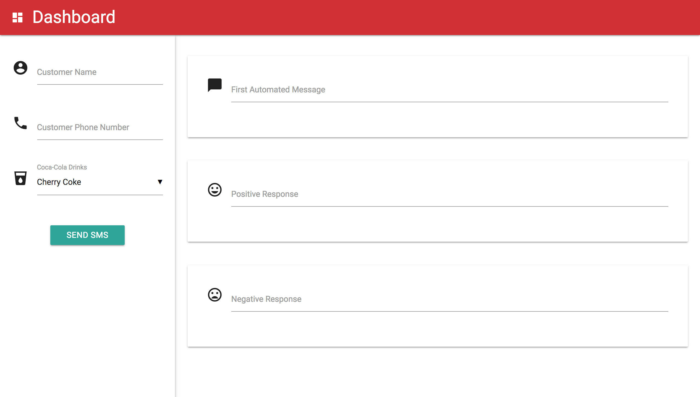

# Product-Chat

Automate SMS responses to customer feedback using sentiment analysis

<p align="center">
  
</p>

# Setup
Assumes a macOS environment.

## Dependencies

### Python
Install the latest versions of Python 2 and 3.

```bash
$ brew install python
$ brew install python3
```

### pip
Install pip.

```bash
$ sudo easy_install pip
```

### MongoDB
Install MongoDB.

```bash
$ brew install mongodb
```

If you're running El Capitan or earlier, execute this instead.

```bash
$ brew install mongodb@3.4
```

Create the database directory. Give write permission to that directory.

```bash
$ sudo mkdir -p /data/db
$ sudo chmod -R go+w /data/db
```

### ngrok
Install ngrok.

```bash
$ brew cask install ngrok
```

### virtualenv
Prepare the virtual environment.

```bash
$ cd dashboard
$ virtualenv venv
$ . venv/bin/activate
```

### Python packages
Install Python packages.

```bash
$ pip install -r requirements.txt
```

-----------------------------------

## Run

### MongoDB
Run the mongod process in a separate terminal window.

```bash
$ /file/path/to/process/.../mongod
```

If you used brew to install MongoDB, the file path should be similar to the one below.

`/usr/local/Cellar/mongodb\@3.4/3.4.13/bin/mongod`

### ngrok
Run ngrok in a separate terminal window.

```bash
$ ngrok http 5000
```

### Twilio
1. Sign in to Twilio to access the dashboard
2. Navigate to Phone Numbers/Manage Numbers/Active Numbers
3. Select a phone number
4. Scroll down to the Messaging section
5. Locate the 'A MESSAGE COMES IN' field
6. Select Webhook in the left dropdown menu
7. Enter the HTTPS ngrok URL in the text field
8. Append `/sms` to the end of the URL
9. Select HTTP POST in the right dropdown menu
10. Save changes

### Environment Variables
Open `environ.sh` and enter values for the five soon-to-be environment variables.

```bash
export TWILIO_ACCOUNT_SID=
export TWILIO_AUTH_TOKEN=
export TWILIO_PHONE_NUMBER=

export TEXT_ANALYTICS_KEY=
export TEXT_ANALYTICS_SENTIMENT_URL=
```

Grant `environ.sh` write permission. Execute the file.

```bash
$ chmod u+x environ.sh
$ source environ.sh
```

### Flask
Start the local server in the same terminal window where `environ.sh` was executed.

```bash
$ flask run
```

Enter the URL `localhost:5000` in a browser.

When it's time to close the application, exit the virtual environment.

```bash
$ deactivate
```

-----------------------------------------------

## Usage

### Customer Phone Number
The customer phone number may be entered in various formats.

```bash
000-000-0000
000 000 0000
000.000.0000

(000)000-0000
(000)000 0000
(000)000.0000
(000) 000-0000
(000) 000 0000
(000) 000.0000

000-0000
000 0000
000.0000

0000000
0000000000
(000)0000000
```

### Tags
The tags `<firstName>` and `<productType>` are replaced by the customer name and drink fields, respectively. All, some, or no tags can be included when editing messages.

### Form
* All form fields are validated before any SMS is sent to a customer.
* Customer name, phone number, and drink fields are cleared after a successful form submission. The message fields are preserved so the same messages can be quickly sent to another customer.
